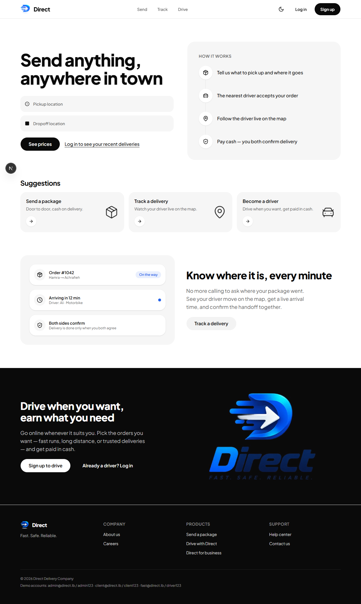
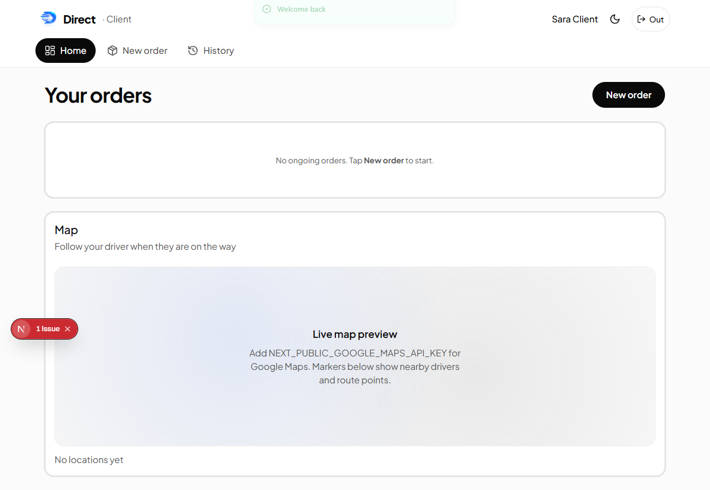
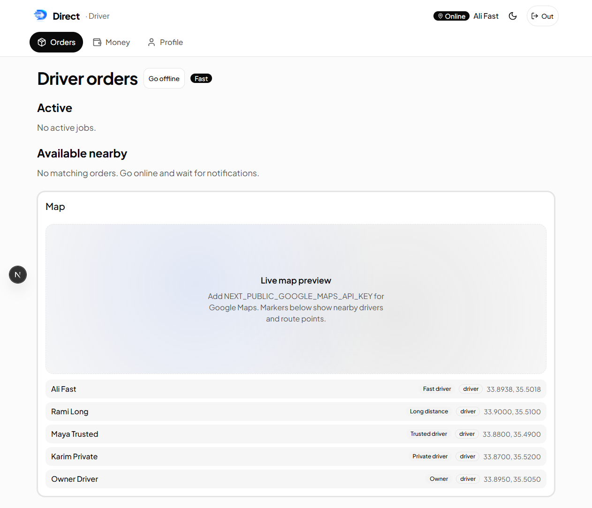
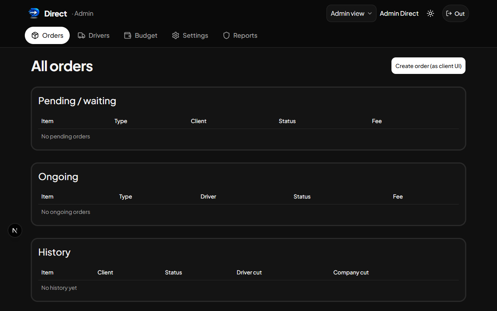

# Direct

Lebanese same-city delivery: send a package, watch the driver on the map, pay cash on arrival, and both sides confirm the handoff.

Phase 1 is a **Next.js** website in an npm-workspaces monorepo, with a **Supabase** Postgres schema for a later production backend. The running UI uses an in-browser demo store, so you can click through every role without API keys.



## Demo mode

Demo mode is the default. There is no login server and no database. Users, orders, documents, and Whish payment records live in `localStorage` under `direct-delivery-demo-v1`.

Open [http://localhost:3000](http://localhost:3000) after `npm run dev`, then sign in with a **demo-only** account below. Admin → Settings can reset the demo data.

`NEXT_PUBLIC_DEMO_MODE` in `apps/web/.env.example` is unused. Pages talk to the demo store either way. Supabase client helpers exist; they are not wired into the UI yet.

## Roles

Four roles share one app:

- **Admin**: all orders, drivers, budget and Whish confirms, businesses, documents, reports, and company settings. Use **Admin view** to impersonate another role.
- **Client**: place an order, follow the driver, confirm delivery, and open receipts.
- **Business**: the same send and track flow as a client, plus a pinned shop pickup and per-order cost limits that an admin can edit.
- **Driver**: go online, claim nearby jobs, advance status, pay the company cut, and upload documents. Types: fast, long distance, trusted, private, and owner.

| Client | Driver | Admin |
|--------|--------|-------|
|  |  |  |

## Demo logins (demo-only)

These accounts and passwords are **demo-only**. They exist only in the browser seed. Do not reuse them in production, on a live Supabase project, or as real credentials.

| Role | Email | Password |
|------|-------|----------|
| Admin | `admin@direct.lb` | `admin123` |
| Client | `client@direct.lb` | `client123` |
| Business | `business@direct.lb` | `biz123` |
| Fast driver | `fast@direct.lb` | `driver123` |
| Long distance | `long@direct.lb` | `driver123` |
| Trusted | `trusted@direct.lb` | `driver123` |
| Private | `private@direct.lb` | `driver123` |
| Owner | `owner@direct.lb` | `driver123` |

The login screen also lists a short subset of these **demo-only** accounts.

## Stack

- **Next.js 16** App Router, React 19, Tailwind CSS, shadcn/ui
- **npm workspaces** monorepo: `apps/*` and `packages/*`
- **`@direct/shared`**: roles, dual-currency fares (USD / LBP), Zod schemas, ETA helpers
- **Supabase**: SQL migrations, row-level security, and RPCs such as `claim_order` under `supabase/migrations`
- Optional **Google Maps** when `NEXT_PUBLIC_GOOGLE_MAPS_API_KEY` is set
- **Whish Pay** server routes when `WHISH_*` credentials are present

## Repository structure

- `apps/web`: Next.js UI (the Phase 1 product)
- `packages/shared`: shared TypeScript used by the web app (and later by mobile)
- `supabase/migrations`: Postgres schema for production
- `apps/mobile`: Phase 2 placeholder only (see below)
- `design-system/direct-delivery`: UI source of truth
- `docs/screenshots`: landing, login, client, driver, and admin captures

## Whish

Drivers pay the company cut to Whish number **81848663**. In demo mode, the driver marks the payment and an admin confirms it under **Budget → Whish**.

Set `WHISH_CHANNEL` and `WHISH_SECRET` when merchant credentials are ready. Those keys let the app start a collect request. Without them, the manual confirm path stays in place.

Admin → Settings switches the default plan between **subscription** (drivers keep delivery fees) and **percentage of order**.

## Phase 2 mobile

`apps/mobile` is a README placeholder. There is no Expo project, `package.json`, or native code in this repository.

The planned native app will reuse the same Supabase database, design tokens, and client / business / driver / admin flows, plus native push and background location. Do not treat this folder as a runnable app.

## How to run

Requires Node.js 20+.

```bash
npm install
npm run dev
```

Open [http://localhost:3000](http://localhost:3000) and sign in with a **demo-only** account from the table above.

### Optional: Google Maps

Copy `apps/web/.env.example` to `apps/web/.env.local` and set `NEXT_PUBLIC_GOOGLE_MAPS_API_KEY`. Without it, map panels still show markers and route hints.

### Optional: Supabase (schema only)

The live UI does not read these keys yet. The SQL is ready for a production cutover:

1. Create a Supabase project.
2. Apply the whole `supabase/migrations` folder in order (`supabase db push` on a linked project, or `supabase db reset` locally). Do not apply only `20260828000000_init.sql`.
3. Copy `apps/web/.env.example` to `apps/web/.env.local` and fill `NEXT_PUBLIC_SUPABASE_URL` and `NEXT_PUBLIC_SUPABASE_ANON_KEY`.
4. Promote an admin with `supabase/seed_admin.sql` (Auth `raw_app_meta_data.role = admin`, which becomes JWT `app_metadata`, not `profiles.role`).

## License

[MIT](LICENSE)
